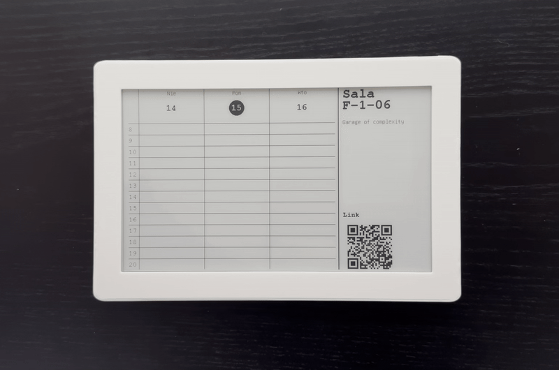

# UniSync

## Description of the project

The UniSync system provides real-time synchronization with our custom-built web platform, which leverages the USOS API to display live classroom schedules. The platform also enables users to book classrooms and display important announcements from teachers.

## Science and tech used

#### Hardware

- Seeed Studio XIAO ESP32C6
- ePaper Breakout Board
- Waveshare 7.5" E-Ink display, 800×480
- Li-Pol battery - 1050 mAh, 3.7 V
- Raspberry Pi 5 as web server

You can find the circuit diagram in the [hardware](./hardware/) directory.

#### Web Platform

- Next.js
- USOS API
- Docker
- Cloudflare Tunnel

## State of the art

The UniSync has reached the prototype stage and is now ready for initial testing within the university environment.

## What next?

If the UniSync system proves successful during the limited testing phase, we have several proposals for further project development.

#### For large-scale deployment, the following improvements are proposed:

#### Device updates:

- Implement Wi-Fi HaLow (Wi-Fi Sub-1GHz) for long-range, low-power connectivity
- Add multilingual support
- Battery level indicator
- Case redesign
- NFC support for instant access to the booking page

#### Web Platform:

- Add multilingual support
- Microsoft Teams integration (for notifications)
- Google Chrome extension for teachers

These improvements will help make UniSync more practical and secure for wider use across the university. The whole system (both device and web platform) can be further refined based on testing results.

## Authors

- Viktoriia Iashchuk
- Vitalii Kazakevich

## Sources

- [Getting Started with Seeed Studio XIAO ESP32C6](https://wiki.seeedstudio.com/xiao_esp32c6_getting_started/)
- [The UniLog Device](https://github.com/ComplexityGarage/Lecture-attendance-monitoring-device)
